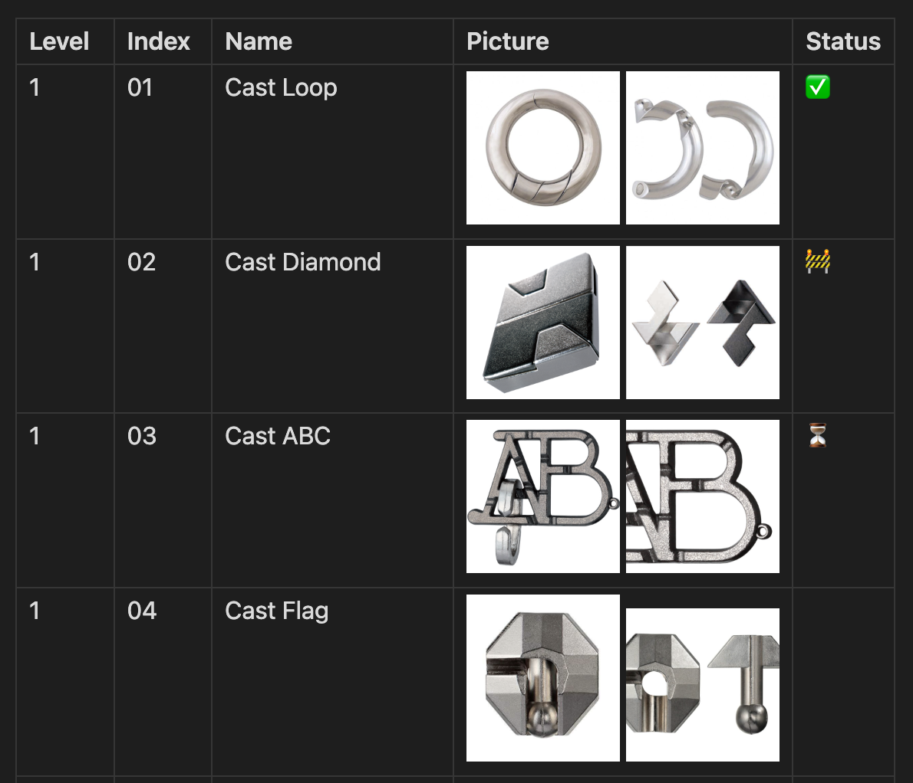

> [!WARNING]
> Deprecated in favour of
> [Track-a-Lot](https://github.com/revolter/obsidian-track-a-lot-plugin)
> (https://obsidian.md/plugins?id=track-a-lot).
>
> Migration instructions:
> - Uninstall this plugin
> - Install the Track-a-Lot plugin
> - Open `Settings` > `Track-a-Lot`
> - Enable the `Hanayama Huzzles` recipe

# Hanayama Huzzles Tracker Plugin

This is a Hanayama Huzzle puzzles tracker plugin for Obsidian (https://obsidian.md).

It scrapes the Hanayama Huzzle webpage (https://hanayama-toys.com/product-category/puzzles/huzzle),
builds a Markdown table with the information, and allows you to manually track them using a status
column.

You can write anything in the status column, and it will be preserved when you update the list.

## Usage

- Create or select a note
- Make sure the note is in editing mode (https://help.obsidian.md/Editing+and+formatting/Edit+and+preview+Markdown)
- Open the command palette (https://help.obsidian.md/Plugins/Command+palette)
- Search for the `Hanayama Huzzles Tracker: Update list` command
- Press <kbd>Enter</kbd>
